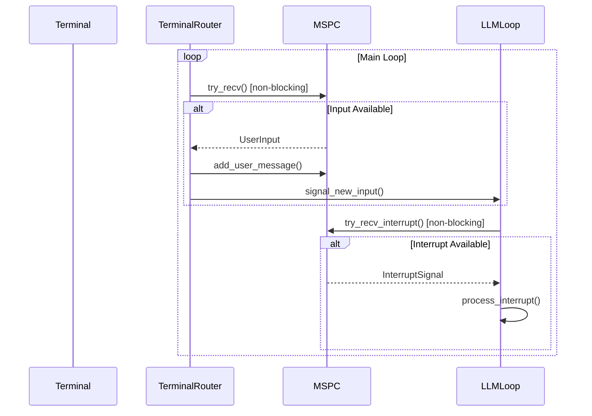
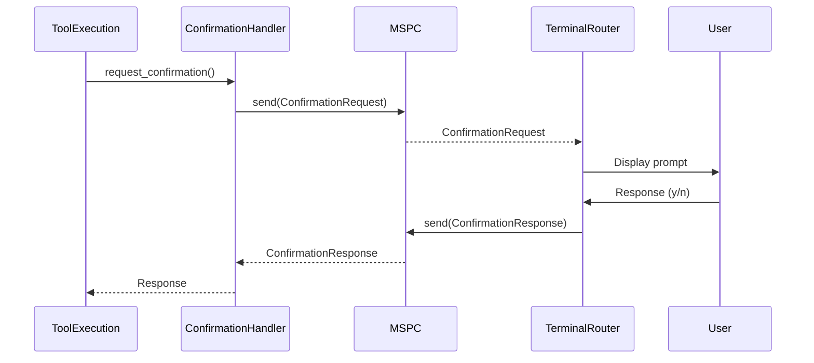

# APChat Architecture Diagram

## Current Architecture (Before MSPC Implementation)

```mermaid
graph TD
    subgraph Main Process
        A[main()] --> B[CLI Parsing]
        B --> C[Mode Selection]
        C --> D[REPL Mode]
        C --> E[Task Mode]
        C --> F[Web Server Mode]
    end

    subgraph REPL Mode
        D --> G[Terminal Setup]
        G --> H[Readline Initialization]
        H --> I[Main Loop]
        I --> J[rl.readline() - BLOCKING]
        J --> K[Input Processing]
        K --> L[Chat Session]
        L --> M[LLM API Call]
        M --> N[Response Processing]
        N --> I
    end

    subgraph Chat Session
        L --> O[Message History]
        L --> P[Tool Execution]
        L --> Q[Cancellation Check]
        P --> R[Progress Evaluation]
        R --> L
    end

    subgraph Web Server
        F --> S[WebSocket Handler]
        S --> T[Session Manager]
        T --> U[Broadcast Channel]
        U --> V[WebSocket Clients]
        T --> W[Confirmation System]
        W --> X[Pending Confirmations]
    end

    style I fill:#f9f,stroke:#333
    style J fill:#f99,stroke:#333
    style Q fill:#f99,stroke:#333
```

## Proposed MSPC Architecture (After Implementation)

```mermaid
graph TD
    subgraph Main Process
        A[main()] --> B[CLI Parsing]
        B --> C[Mode Selection]
        C --> D[REPL Mode]
        C --> E[Task Mode]
        C --> F[Web Server Mode]
    end

    subgraph MSPC System
        Y[MSPC Channel] -->|UserInput| Z[Input Router]
        Y -->|Interrupt| AA[Interrupt Handler]
        Y -->|ConfirmationRequest| AB[Confirmation Handler]
        Y -->|ConfirmationResponse| AB
        Z -->|Terminal| AC[Terminal Input Router]
        Z -->|Webex| AD[Webex Input Router (stub)]
    end

    subgraph REPL Mode
        D --> G[Terminal Setup]
        G --> H[MSPC Channel Creation]
        H --> I[Main Loop]
        I --> J[Non-blocking Channel Check]
        J --> K[Input Processing]
        K --> L[Chat Session]
        L --> M[LLM API Call]
        M --> N[Response Processing]
        N --> I
        I -->|Periodic| J
        I -->|Immediate| AA
    end

    subgraph Chat Session
        L --> O[Message History]
        L --> P[Tool Execution]
        L --> Q[Cancellation Check]
        P --> R[Progress Evaluation]
        R --> L
    end

    subgraph Web Server
        F --> S[WebSocket Handler]
        S --> T[Session Manager]
        T --> U[Broadcast Channel]
        U --> V[WebSocket Clients]
        T --> W[Confirmation System]
        W --> X[Pending Confirmations]
        W -->|Confirmation| Y
    end

    style I fill:#bbf,stroke:#333
    style J fill:#bfb,stroke:#333
    style Y fill:#bfb,stroke:#333
    style AA fill:#f99,stroke:#333
```

## Message Flow Comparison

### Current Flow (Blocking)
```
User Types → [BLOCKS HERE] → Input Processed → LLM Called → Response Displayed → Repeat
```

### Proposed Flow (Non-blocking with MSPC)
```
User Types → Input Router → MSPC Channel → Input Queue → Processed at Appropriate Time

Interrupt! → Input Router → MSPC Channel → Interrupt Handler → Immediate Processing

Confirmation Request → MSPC Channel → Confirmation Handler → User Response → MSPC Channel → Continue
```

## Component Interactions

### Terminal Input Router


### Confirmation Flow


## Data Structures

### MSPC Message Types
```rust
enum MspcMessage {
    UserInput(String),              // Regular user input
    InterruptSignal(String),        // Immediate interrupt (!command)
    ConfirmationRequest {
        prompt: String,
        default: bool,
    },
    ConfirmationResponse(bool),    // User confirmation
    Command(String),                // Slash commands (/help, /model)
    SystemPrompt(String),           // System-level messages
}
```

### MSPC Channel Structure
```rust
struct MspcChannel {
    sender: Sender<MspcMessage>,
    receiver: Receiver<MspcMessage>,
    message_history: Vec<MessagePair>,
    interrupt_queue: Vec<String>,
    confirmation_queue: HashMap<String, oneshot::Sender<bool>>,
}

struct MessagePair {
    user: String,      // User message
    agent: String,     // Agent response
    timestamp: DateTime,
}
```

## Integration Points Summary

| Current Component | Integration Point | Changes Required |
|-------------------|------------------|------------------|
| rustyline readline | Replace blocking call | High - Need non-blocking alternative |
| Main chat loop | Add channel checks | Medium - Add periodic checks |
| Confirmation system | Route through MSPC | Medium - Refactor confirmation flow |
| Message history | Maintain consistency | Low - Already robust |
| WebSocket handler | Connect to MSPC | Low - Already uses channels |
| Tool execution | Interrupt handling | Medium - Add interrupt checks |

## Performance Considerations

### Before MSPC
- Blocking I/O: Entire application waits for input
- No concurrency: Single thread handles everything
- Poor responsiveness: Can't process interrupts during LLM calls

### After MSPC
- Non-blocking I/O: Application continues while waiting
- Concurrent processing: Multiple inputs can be queued
- Better responsiveness: Interrupts processed immediately
- Resource usage: Slightly higher (channel overhead)

## Backward Compatibility

### Preserved Features
- ✅ All existing commands (/help, /model, etc.)
- ✅ Confirmation prompts
- ✅ Message history
- ✅ Tool execution
- ✅ Interrupt handling (Ctrl+C)
- ✅ WebSocket communication

### New Features
- ✅ Custom interrupt commands (!command)
- ✅ Multiple input sources
- ✅ Prioritized message processing
- ✅ Unified confirmation flow
- ✅ Better interrupt handling

### Deprecated Features
- ❌ None - All existing functionality preserved
