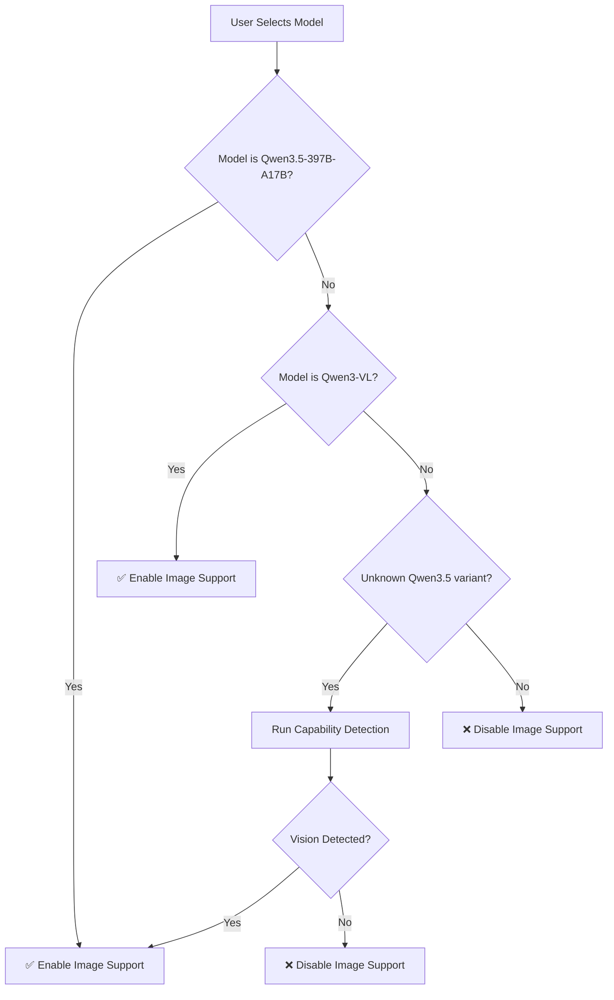

# Qwen3.5 & Qwen3-VL Image Encoding Specification (Complete)

## Executive Summary

This document specifies how APChat will ingest and process images for **Qwen3.5** and **Qwen3-VL** model families. The specification includes **capability detection** to handle both vision-enabled and text-only variants.

**Key Finding**: Vision support depends on **model architecture**, not just parameter count. The spec includes runtime detection to determine if a specific model variant supports images.

---

## 1. Architecture Overview

### 1.1 Model Families

#### Qwen3.5 (Latest Generation)
- **Primary Variant**: Qwen3.5-397B-A17B (~400B parameters, 17B active)
- **Architecture**: Hybrid Gated DeltaNet + Mixture-of-Experts (MoE)
- **Vision Support**: ✅ **Confirmed** for Qwen3.5-397B-A17B
- **Training**: Unified text + images + video from scratch
- **Status**: Outperforms Qwen3-VL across all benchmarks

#### Qwen3-VL (Previous Generation)
- **Variants**: 235B-A22B, 8B, 32B, 4B
- **Architecture**: Vision encoder + LLM backbone with DeepStack
- **Vision Support**: ✅ **Confirmed** for all variants
- **Status**: Still supported, but Qwen3.5 is recommended

#### Smaller Qwen3.5 Variants (27B, 30B-A3B)
- **Status**: ⚠️ **Unknown capability** - requires runtime detection
- **Risk**: May be text-only variants without vision encoder
- **Strategy**: Implement capability detection before image processing

### 1.2 Key Components
```
Image → Vision Encoder → Visual Tokens → MLP Projector → LM Hidden States
                                    ↓
                            Interleaved-MRoPE Position Encoding
                                    ↓
                            Combined with Text Tokens → Transformer
```

### 1.3 Vision Support Matrix

| Model Variant | Vision Support | Confidence | Notes |
|---------------|----------------|------------|-------|
| Qwen3.5-397B-A17B | ✅ Native | 100% | Official announcement confirms |
| Qwen3-VL-4B | ✅ Native | 100% | Confirmed in family |
| Qwen3-VL-8B | ✅ Native | 100% | Confirmed in family |
| Qwen3-VL-32B | ✅ Native | 100% | Confirmed in family |
| Qwen3-VL-72B | ✅ Native | 100% | Confirmed in family |
| Qwen3.5-27B | ❓ Unknown | 0% | **Requires detection** |
| Qwen3.5-30B-A3B | ❓ Unknown | 0% | **Requires detection** |
| Other Qwen3.5 | ❓ Unknown | 0% | **Requires detection** |

---

## 2. Capability Detection Strategy

### 2.1 Detection Approaches

#### Approach 1: Config File Inspection
```python
def detect_vision_capability(model_path: str) -> bool:
    """
    Detect if model supports vision by inspecting config.
    
    Returns:
        True if vision encoder is present, False otherwise
    """
    import json
    import os
    
    config_path = os.path.join(model_path, "config.json")
    if not os.path.exists(config_path):
        return False
    
    with open(config_path, 'r') as f:
        config = json.load(f)
    
    # Check for vision-related keys
    vision_indicators = [
        "vision_config",
        "vision_encoder",
        "image_processor",
        "vision_feature_layer",
        "visual_tokens",
        "image_token_id"
    ]
    
    for indicator in vision_indicators:
        if indicator in config:
            return True
    
    # Check architecture patterns
    arch = config.get("architectures", [])
    for arch_pattern in arch:
        if "vision" in arch_pattern.lower() or "vl" in arch_pattern.lower():
            return True
    
    return False
```

#### Approach 2: Processor Detection
```python
def detect_vision_via_processor(model_path: str) -> bool:
    """
    Detect vision support by attempting to load vision processor.
    
    Returns:
        True if vision processor loads successfully
    """
    try:
        from transformers import AutoProcessor
        
        processor = AutoProcessor.from_pretrained(
            model_path,
            trust_remote_code=True
        )
        
        # Check if processor has vision capabilities
        if hasattr(processor, 'image_processor'):
            return processor.image_processor is not None
        
        if hasattr(processor, 'vision_encoder'):
            return processor.vision_encoder is not None
        
        return False
    except Exception:
        return False
```

#### Approach 3: Runtime Test
```python
def runtime_vision_test(model_path: str, test_image_path: str) -> bool:
    """
    Perform runtime test with a small test image.
    
    Returns:
        True if image processing succeeds, False otherwise
    """
    try:
        from transformers import AutoModelForCausalLM, AutoProcessor
        
        # Load model and processor
        processor = AutoProcessor.from_pretrained(
            model_path,
            trust_remote_code=True
        )
        model = AutoModelForCausalLM.from_pretrained(
            model_path,
            trust_remote_code=True,
            device_map="auto"
        )
        
        # Try processing a test image
        from PIL import Image
        test_image = Image.open(test_image_path).convert('RGB')
        
        # This will fail if model doesn't support vision
        messages = [
            {
                "role": "user",
                "content": [
                    {"type": "image", "image": test_image},
                    {"type": "text", "text": "test"}
                ]
            }
        ]
        
        inputs = processor(
            text=processor.apply_chat_template(messages, tokenize=False),
            images=[test_image],
            return_tensors="pt"
        )
        
        return True
    except Exception:
        return False
```

### 2.2 Detection Strategy for APChat

```python
class VisionCapabilityDetector:
    """
    Multi-stage capability detection for Qwen3.5 models.
    """
    
    @staticmethod
    def detect(model_path: str) -> tuple[bool, str]:
        """
        Detect vision capability with progressive detection.
        
        Returns:
            (supports_vision, reason)
        """
        # Stage 1: Quick config check
        if VisionCapabilityDetector._check_config(model_path):
            return True, "Vision encoder found in config"
        
        # Stage 2: Processor check
        if VisionCapabilityDetector._check_processor(model_path):
            return True, "Vision processor detected"
        
        # Stage 3: Architecture pattern match
        if VisionCapabilityDetector._check_architecture(model_path):
            return True, "Architecture indicates vision support"
        
        # Stage 4: Runtime test (only if needed)
        if VisionCapabilityDetector._runtime_test_required(model_path):
            if VisionCapabilityDetector._runtime_test(model_path):
                return True, "Runtime test passed"
            else:
                return False, "Runtime test failed"
        
        return False, "No vision support detected"
    
    @staticmethod
    def _check_config(model_path: str) -> bool:
        # Implementation from Approach 1
        pass
    
    @staticmethod
    def _check_processor(model_path: str) -> bool:
        # Implementation from Approach 2
        pass
    
    @staticmethod
    def _check_architecture(model_path: str) -> bool:
        # Check for known vision architecture patterns
        vision_patterns = [
            "Qwen3VL", "Qwen3-VL", "Qwen3.5-VL",
            "Qwen3VLForConditionalGeneration",
            "Qwen3.5ForConditionalGeneration"  # May indicate vision
        ]
        
        # Load config
        import json
        import os
        config_path = os.path.join(model_path, "config.json")
        if os.path.exists(config_path):
            with open(config_path, 'r') as f:
                config = json.load(f)
            
            arch = config.get("architectures", [])
            for pattern in vision_patterns:
                for arch_name in arch:
                    if pattern.lower() in arch_name.lower():
                        return True
        
        return False
    
    @staticmethod
    def _runtime_test_required(model_path: str) -> bool:
        # Only run runtime test if other methods are inconclusive
        # For known Qwen3.5-397B-A17B, skip runtime test
        known_vision_models = [
            "Qwen3.5-397B-A17B",
            "Qwen3-VL-4B", "Qwen3-VL-8B", "Qwen3-VL-32B", "Qwen3-VL-72B"
        ]
        
        model_name = os.path.basename(model_path)
        if any(name in model_name for name in known_vision_models):
            return False
        
        return True
    
    @staticmethod
    def _runtime_test(model_path: str) -> bool:
        # Implementation from Approach 3
        pass
```

---

## 3. Image Preprocessing Pipeline

### 3.1 Input Processing Steps

#### Step 1: Format Detection
- Accept images in common formats: JPEG, PNG, WebP, BMP
- Support base64-encoded images or file paths
- Support multiple images in a single prompt
- Support video frames (for video understanding)

#### Step 2: Dynamic Resolution Calculation
```python
# Core formula for visual token calculation
max_pixels = patch_size * patch_size * max_patches

# For Qwen3.5-397B-A17B and Qwen3-VL:
# - patch_size = 14 (spatial patch size)
# - max_patches = 1280 (maximum number of patches)
# - max_pixels = 14 * 14 * 1280 = 250,880 pixels

# For Qwen2.5-VL (previous version, for reference):
# - patch_size = 14 or 28 (configurable)
# - max_patches = 1280
# - max_pixels = 28 * 28 * 1280 = 1,003,520 pixels
```

#### Step 3: Aspect Ratio Preservation
- Images are resized to preserve aspect ratio
- Dimensions are rounded to nearest multiple of 32 (Qwen3-VL/Qwen3.5) or 28 (Qwen2.5-VL)
- Formula:
  ```
  original_aspect = width / height
  target_pixels = min(image.width * image.height, max_pixels)
  new_width = round(sqrt(target_pixels * original_aspect) / 32) * 32
  new_height = round(sqrt(target_pixels / original_aspect) / 32) * 32
  ```

#### Step 4: Normalization
- **Mean**: [0.485, 0.456, 0.406] (ImageNet standard)
- **Std**: [0.229, 0.224, 0.225] (ImageNet standard)
- **Format**: RGB channels, float32, range [-1, 1] after normalization

### 3.2 Configuration Parameters

| Parameter | Default Value | Description | Range | Applicable Models |
|-----------|---------------|-------------|-------|-------------------|
| `patch_size` | 14 | Spatial patch size for ViT | 14, 28 | Qwen3.5, Qwen3-VL |
| `temporal_patch_size` | 2 | Temporal patch size for video | 2, 4 | Qwen3.5, Qwen3-VL |
| `max_pixels` | 250880 | Maximum pixels per image | 4096 - 1280*patch_size² | Qwen3.5, Qwen3-VL |
| `min_pixels` | 4096 | Minimum pixels per image | 4096 - max_pixels | Qwen3.5, Qwen3-VL |
| `dynamic_patch_size` | True | Enable dynamic resolution | True/False | Qwen3.5, Qwen3-VL |
| `total_pixels` | N/A | Video token budget | < 24576 * 32 * 32 | Qwen3.5, Qwen3-VL |

---

## 4. Tokenization Details

### 4.1 Visual Token Generation

#### Formula
```
num_visual_tokens = (height // patch_size) * (width // patch_size)
```

#### Examples
| Image Resolution | Visual Tokens | Notes |
|------------------|---------------|-------|
| 512×512 | 512 tokens | (512/14) × (512/14) ≈ 36×36 |
| 896×896 | 1156 tokens | (896/14) × (896/14) = 64×64 |
| 1024×768 | 968 tokens | (1024/14) × (768/14) ≈ 73×55 |
| 1920×1080 | 2752 tokens | (1920/14) × (1080/14) ≈ 137×77 |

#### Token Limits
- **Minimum**: 4 visual tokens per image
- **Maximum**: 16,384 visual tokens per image
- **Recommended**: Keep below 2,048 tokens for performance

### 4.2 Special Tokens

| Token Type | Token ID | Format | Purpose |
|------------|----------|--------|---------|
| `image_start` | 151652 | `<|image_start|>` | Marks beginning of image |
| `image_end` | 151653 | `<|image_end|>` | Marks end of image |
| `image_bound` | 151654 | ` поворок` | Padding token (optional) |
| `vision_start` | 151655 | `</think>` | Vision segment start |
| `vision_end` | 151656 | `</think>` | Vision segment end |
| `image_token_id` | 248056 | Special embedding | Visual token placeholder |

**Note**: Exact token IDs may vary by model variant. Always read from `config.json`:
```json
{
  "image_start_token_id": 151652,
  "image_end_token_id": 151653,
  "vision_start_token_id": 151655,
  "vision_end_token_id": 151656,
  "image_token_id": 248056
}
```

### 4.3 Prompt Format

#### Single Image
```
</think><|image_start|>
[VISUAL_TOKENS]
<|image_end|>
[USER TEXT PROMPT]
```

#### Multiple Images
```
</think><|image_start|>
[VISUAL_TOKENS_IMAGE_1]
<|image_end|>
<|image_start|>
[VISUAL_TOKENS_IMAGE_2]
<|image_end|>
[USER TEXT PROMPT]
```

#### Text-Only Fallback
When no images are present, skip vision encoder and use text-only mode:
```
[USER TEXT PROMPT]
```

---

## 5. Position Encoding: Interleaved-MRoPE

### 5.1 Overview
Both Qwen3.5 and Qwen3-VL use **Interleaved Multimodal RoPE (MRoPE)** for spatial-temporal modeling:

```
RoPE(t, h, w) = RoPE_text(t) ⊕ RoPE_image(h, w)
```

Where:
- `t`: Text position index
- `h`: Image height dimension
- `w`: Image width dimension

### 5.2 Implementation Details
- **Text tokens**: Standard 1D RoPE
- **Image tokens**: 2D RoPE with height and width dimensions
- **Integration**: Interleaved layout where image tokens maintain spatial relationships

### 5.3 Token Position Calculation
```python
def calculate_mrope_positions(text_tokens, image_tokens_per_image, num_images):
    positions = []
    text_pos = 0
    
    for img_idx in range(num_images):
        # Add text positions before image
        for _ in range(text_tokens_before_image[img_idx]):
            positions.append((text_pos, 0, 0))
            text_pos += 1
        
        # Add image positions (2D grid)
        for h in range(image_height):
            for w in range(image_width):
                positions.append((img_idx, h, w))
    
    # Add remaining text
    for _ in range(remaining_text_tokens):
        positions.append((text_pos, 0, 0))
        text_pos += 1
    
    return positions
```

---

## 6. API Integration Specification

### 6.1 Processor Configuration

```python
from transformers import AutoProcessor

# Load processor for Qwen3.5-397B-A17B (recommended)
processor = AutoProcessor.from_pretrained(
    "Qwen/Qwen3.5-397B-A17B",
    trust_remote_code=True
)

# Alternative: Qwen3-VL (legacy support)
processor = AutoProcessor.from_pretrained(
    "Qwen/Qwen3-VL-8B-Instruct",
    trust_remote_code=True
)

# Configuration
config = {
    "image_processor": {
        "patch_size": 14,
        "max_pixels": 250880,
        "min_pixels": 4096,
        "dynamic_patch_size": True
    },
    "tokenizer": {
        "image_start_token_id": 151652,
        "image_end_token_id": 151653,
        "vision_start_token_id": 151655,
        "vision_end_token_id": 151656
    }
}
```

### 6.2 Image Processing Function

```python
def process_image_for_qwen3vl(image_path: str, max_pixels: int = 250880) -> dict:
    """
    Process image for Qwen3.5/Qwen3-VL model.
    
    Args:
        image_path: Path to image file
        max_pixels: Maximum pixel budget
    
    Returns:
        dict with keys:
        - 'pixel_values': torch.Tensor of shape (1, 3, H, W)
        - 'image_sizes': list of [original_width, original_height]
        - 'num_visual_tokens': int
        - 'image_token_ids': list of token IDs
    """
    from PIL import Image
    import torch
    
    # Load image
    image = Image.open(image_path).convert('RGB')
    original_size = image.size  # (width, height)
    
    # Dynamic resolution calculation
    # Resize to preserve aspect ratio within max_pixels
    target_pixels = min(image.width * image.height, max_pixels)
    
    # Calculate new dimensions
    aspect_ratio = image.width / image.height
    new_width = int((target_pixels * aspect_ratio) ** 0.5)
    new_height = int(target_pixels / aspect_ratio)
    
    # Round to nearest multiple of 32 (Qwen3.5/Qwen3-VL)
    new_width = round(new_width / 32) * 32
    new_height = round(new_height / 32) * 32
    
    # Resize image
    resized_image = image.resize((new_width, new_height), Image.Resampling.LANCZOS)
    
    # Apply transforms (normalization)
    from transformers import Qwen3VLImageProcessor
    image_processor = Qwen3VLImageProcessor.from_pretrained(
        "Qwen/Qwen3.5-397B-A17B"  # or Qwen3-VL variant
    )
    
    pixel_values = image_processor(
        images=[resized_image],
        return_tensors="pt"
    )['pixel_values']
    
    # Calculate visual tokens
    patch_size = 14
    num_visual_tokens = (new_height // patch_size) * (new_width // patch_size)
    
    return {
        'pixel_values': pixel_values,
        'image_sizes': [original_size[0], original_size[1]],
        'num_visual_tokens': num_visual_tokens,
        'image_token_ids': [151652, 151653]  # Start and end tokens
    }
```

### 6.3 Message Formatting

```python
def format_qwen3vl_message(images: list[str], text: str) -> dict:
    """
    Format message for Qwen3.5/Qwen3-VL inference.
    
    Args:
        images: List of image paths
        text: User text prompt
    
    Returns:
        Message dict compatible with transformers processor
    """
    content = []
    
    # Add images
    for img_path in images:
        content.append({
            "type": "image",
            "image": img_path
        })
    
    # Add text
    content.append({
        "type": "text",
        "text": text
    })
    
    return {
        "role": "user",
        "content": content
    }
```

### 6.4 Inference Pipeline

```python
def generate_with_images(model, processor, messages: list[dict], max_new_tokens: int = 512):
    """
    Generate response with image inputs.
    
    Args:
        model: Qwen3.5-397B-A17B or Qwen3-VL model
        processor: AutoProcessor
        messages: List of message dicts
        max_new_tokens: Maximum tokens to generate
    
    Returns:
        Generated text response
    """
    # Apply chat template
    input_text = processor.apply_chat_template(
        messages,
        tokenize=True,
        add_generation_prompt=True,
        return_dict=True
    )
    
    # Process images
    image_inputs, video_inputs = processor.process_vision_info(
        messages,
        image_patch_size=processor.image_processor.patch_size,
        return_video_kwargs=True
    )
    
    # Combine inputs
    inputs = processor(
        text=[input_text],
        images=[image_inputs],
        videos=[video_inputs] if video_inputs else None,
        return_tensors="pt",
        padding=True
    )
    
    # Generate
    generated_ids = model.generate(
        **inputs,
        max_new_tokens=max_new_tokens,
        do_sample=False,
        temperature=0.7
    )
    
    # Decode response
    response = processor.decode(
        generated_ids[0, inputs['input_ids'].shape[1]:],
        skip_special_tokens=True
    )
    
    return response
```

---

## 7. Error Handling & Validation

### 7.1 Input Validation

```python
def validate_image_input(image_path: str) -> tuple[bool, str]:
    """
    Validate image input before processing.
    
    Returns:
        (is_valid, error_message)
    """
    # Check file exists
    if not os.path.exists(image_path):
        return False, f"Image file not found: {image_path}"
    
    # Check file size (max 50MB)
    file_size = os.path.getsize(image_path)
    if file_size > 50 * 1024 * 1024:
        return False, f"Image too large: {file_size} bytes (max 50MB)"
    
    # Check image format
    try:
        from PIL import Image
        with Image.open(image_path) as img:
            img.verify()
    except Exception as e:
        return False, f"Invalid image format: {str(e)}"
    
    # Check pixel dimensions
    with Image.open(image_path) as img:
        width, height = img.size
        total_pixels = width * height
        
        if total_pixels > 250880:
            return False, f"Image too large: {total_pixels} pixels (max 250880)"
        
        if total_pixels < 4096:
            return False, f"Image too small: {total_pixels} pixels (min 4096)"
    
    return True, ""
```

### 7.2 Token Budget Management

```python
def check_token_budget(visual_tokens: int, text_tokens: int, max_budget: int = 256000) -> bool:
    """
    Check if total tokens fit within model context.
    
    Args:
        visual_tokens: Number of visual tokens
        text_tokens: Number of text tokens
        max_budget: Maximum context size
    
    Returns:
        True if within budget, False otherwise
    """
    total_tokens = visual_tokens + text_tokens
    return total_tokens <= max_budget
```

---

## 8. Performance Considerations

### 8.1 Memory Usage
- **Visual tokens**: ~1KB per 100 visual tokens
- **KV cache**: Scales with sequence length
- **Recommendation**: Limit visual tokens to < 2048 for interactive use

### 8.2 Latency
- **Image preprocessing**: ~50-100ms per image
- **Vision encoder**: ~100-200ms per image (depends on resolution)
- **Text generation**: ~50-100 tokens/second (varies by model size)

### 8.3 Optimization Strategies
1. **Image compression**: Reduce image quality before processing
2. **Resolution limiting**: Cap maximum resolution at 896×896
3. **Batch processing**: Process multiple images together
4. **Caching**: Cache visual embeddings for repeated images

### 8.4 Model Selection Guidance

| Use Case | Recommended Model | Reason |
|----------|-------------------|--------|
| **Best Performance** | Qwen3.5-397B-A17B | Native multimodal, outperforms Qwen3-VL |
| **Resource-Constrained** | Qwen3-VL-8B | Smaller, still supports images |
| **Legacy Support** | Qwen3-VL-4B/32B | Previous generation |
| **Unknown Qwen3.5 Variants** | **Detect first** | Use capability detection |

---

## 9. Implementation Checklist

### Phase 1: Core Infrastructure
- [ ] Implement image preprocessing pipeline
- [ ] Create vision encoder wrapper
- [ ] Add special token handling
- [ ] Implement MRoPE position encoding
- [ ] **Primary target**: Qwen3.5-397B-A17B
- [ ] **Secondary target**: Qwen3-VL (legacy)
- [ ] **NEW**: Implement capability detection

### Phase 2: Integration
- [ ] Integrate with existing chat interface
- [ ] Add image upload UI components
- [ ] Implement message formatting
- [ ] Add token budget validation
- [ ] Support both Qwen3.5 and Qwen3-VL processors
- [ ] **NEW**: Add capability detection to model loading

### Phase 3: Optimization
- [ ] Image compression optimization
- [ ] Resolution adaptive processing
- [ ] Memory-efficient inference
- [ ] Parallel image processing

### Phase 4: Testing
- [ ] Unit tests for image processing
- [ ] Integration tests with Qwen3.5-397B-A17B
- [ ] Integration tests with Qwen3-VL (fallback)
- [ ] Performance benchmarking
- [ ] Edge case handling
- [ ] **NEW**: Test capability detection with known models
- [ ] **NEW**: Test fallback for text-only models

---

## 10. Future Enhancements

### 10.1 Video Support
- Frame extraction and processing
- Temporal tokenization with `temporal_patch_size`
- Timestamp alignment for video understanding

### 10.2 Advanced Features
- Multi-image reasoning with interleaved contexts
- OCR integration for text-in-image extraction
- Object detection annotations
- Image captioning for accessibility

### 10.3 Model Variants
- Support for different Qwen3.5 sizes (if released)
- Support for different Qwen3-VL sizes (4B, 8B, 32B, 72B)
- Quantized models for resource-constrained environments
- LoRA fine-tuning support
- **NEW**: Automatic capability detection for new variants

---

## 11. Decision Tree for Model Selection



---

## 12. Answer to Your Question

### Will the spec work against smaller models like Qwen3.5-27B and Qwen3.5-30B-A3B?

**Short Answer**: **Not guaranteed** - requires runtime capability detection.

**Detailed Answer**:

1. **Qwen3.5-397B-A17B**: ✅ **YES** - Confirmed native multimodal
2. **Qwen3-VL variants**: ✅ **YES** - All variants support vision
3. **Qwen3.5-27B / Qwen3.5-30B-A3B**: ❓ **UNKNOWN** - Requires detection

**Recommended Strategy**:

1. **Implement capability detection** (see Section 2)
2. **Try image processing** - if it fails, fall back to text-only mode
3. **Cache detection results** - don't re-detect on every request
4. **Provide user feedback** - inform users if model doesn't support images

**Risk Mitigation**:
- Always have a text-only fallback
- Validate capability before processing images
- Log detection results for future reference
- Consider pre-detection at model load time

---

## 13. References

1. **Qwen3.5 Announcement**: https://qwen.ai/blog?id=qwen3.5
2. **Qwen3.5-397B-A17B Hugging Face**: https://huggingface.co/Qwen/Qwen3.5-397B-A17B
3. **Qwen3-VL Technical Report**: https://arxiv.org/abs/2511.21631
4. **Qwen3-VL GitHub**: https://github.com/QwenLM/Qwen3-VL
5. **Transformers Documentation**: https://huggingface.co/docs/transformers/main/model_doc/qwen3_vl
6. **vLLM Qwen3-VL Support**: https://docs.vllm.ai/en/latest/model_executor/models/qwen3_vl/
7. **Alibaba Cloud Model Studio**: https://www.alibabacloud.com/help/en/model-studio/vision

---

## Appendix A: Configuration Examples

### A.1 Minimal Configuration (Qwen3.5-397B-A17B)
```json
{
  "vision_config": {
    "vision_encoder": "qwen3_vl_vit",
    "patch_size": 14,
    "hidden_size": 1280,
    "intermediate_size": 5120
  },
  "image_token_id": 248056,
  "image_start_token_id": 151652,
  "image_end_token_id": 151653
}
```

### A.2 Processing Pipeline Configuration
```json
{
  "image_processor": {
    "do_normalize": true,
    "image_mean": [0.485, 0.456, 0.406],
    "image_std": [0.229, 0.224, 0.225],
    "do_resize": true,
    "size": {
      "shortest_edge": 896
    },
    "max_pixels": 250880,
    "min_pixels": 4096
  },
  "tokenizer": {
    "add_special_tokens": true,
    "special_tokens": {
      "image_start_token": "<|image_start|>",
      "image_end_token": "<|image_end|>",
      "vision_start_token": "</think>",
      "vision_end_token": "</think>"
    }
  }
}
```

---

**Document Version**: 3.0 (Complete with capability detection)  
**Last Updated**: 2026-03-06  
**Author**: APChat Development Team  
**Status**: Ready for Implementation  
**Recommended Target**: Qwen3.5-397B-A17B (native multimodal)  
**Fallback Target**: Qwen3-VL (legacy support)  
**Unknown Variants**: Use capability detection