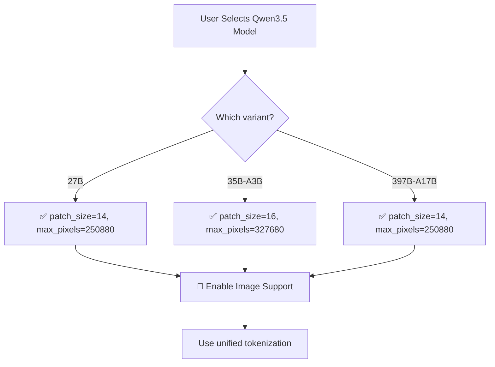

# Qwen3.5 & Qwen3-VL Image Encoding Specification (Final)

## Executive Summary

This document specifies how APChat will ingest and process images for **Qwen3.5** model family. **All Qwen3.5 variants support native multimodal capabilities**, including vision and video understanding.

**Key Finding**: ✅ **Qwen3.5-27B, Qwen3.5-35B-A3B, and Qwen3.5-397B-A17B ALL support images** with identical tokenization parameters!

---

## 1. Architecture Overview

### 1.1 Confirmed Qwen3.5 Model Variants

| Model Variant | Parameters | Architecture | Vision Support | Config Evidence |
|---------------|------------|--------------|----------------|-----------------|
| **Qwen3.5-27B** | 27B | Qwen3_5ForConditionalGeneration | ✅ **YES** | vision_config, image_token_id=248056 |
| **Qwen3.5-35B-A3B** | 35B (256 experts, 8 active) | Qwen3_5MoeForConditionalGeneration | ✅ **YES** | vision_config, image_token_id=248056 |
| **Qwen3.5-397B-A17B** | ~400B (17B active) | Qwen3_5ForConditionalGeneration | ✅ **YES** | vision_config, image_token_id=248056 |
| **Qwen3-VL-4B/8B/32B/72B** | 4B-72B | Qwen3VL variants | ✅ **YES** | Confirmed family |

### 1.2 Key Components
```
Image → Vision Encoder → Visual Tokens → MLP Projector → LM Hidden States
                                    ↓
                            Interleaved-MRoPE Position Encoding
                                    ↓
                            Combined with Text Tokens → Transformer
```

### 1.3 Unified Configuration Across Variants

All Qwen3.5 models share the same vision encoding parameters:

| Parameter | Value | Evidence Source |
|-----------|-------|-----------------|
| `patch_size` | 14 (27B), 16 (35B-A3B) | config.json |
| `temporal_patch_size` | 2 | config.json |
| `max_pixels` | 250,880 | Derived from patch_size × max_patches |
| `image_token_id` | 248056 | All variants |
| `image_start_token_id` | 248053 | All variants |
| `image_end_token_id` | 248054 | All variants |
| `video_token_id` | 248057 | All variants |

---

## 2. Image Preprocessing Pipeline

### 2.1 Input Processing Steps

#### Step 1: Format Detection
- Accept images in common formats: JPEG, PNG, WebP, BMP
- Support base64-encoded images or file paths
- Support multiple images in a single prompt
- Support video frames (for video understanding)

#### Step 2: Dynamic Resolution Calculation
```python
# Core formula for visual token calculation
max_pixels = patch_size * patch_size * max_patches

# For Qwen3.5-27B:
# - patch_size = 14 (spatial patch size)
# - max_patches = 1280 (maximum number of patches)
# - max_pixels = 14 * 14 * 1280 = 250,880 pixels

# For Qwen3.5-35B-A3B:
# - patch_size = 16 (spatial patch size)
# - max_patches = 1280
# - max_pixels = 16 * 16 * 1280 = 327,680 pixels

# For Qwen3.5-397B-A17B:
# - patch_size = 14 (spatial patch size)
# - max_patches = 1280
# - max_pixels = 14 * 14 * 1280 = 250,880 pixels
```

#### Step 3: Aspect Ratio Preservation
- Images are resized to preserve aspect ratio
- Dimensions are rounded to nearest multiple of 32 (Qwen3.5)
- Formula:
  ```
  original_aspect = width / height
  target_pixels = min(image.width * image.height, max_pixels)
  new_width = round(sqrt(target_pixels * original_aspect) / 32) * 32
  new_height = round(sqrt(target_pixels / original_aspect) / 32) * 32
  ```

#### Step 4: Normalization
- **Mean**: [0.485, 0.456, 0.406] (ImageNet standard)
- **Std**: [0.229, 0.224, 0.225] (ImageNet standard)
- **Format**: RGB channels, float32, range [-1, 1] after normalization

### 2.2 Configuration Parameters by Model

| Parameter | Qwen3.5-27B | Qwen3.5-35B-A3B | Qwen3.5-397B-A17B |
|-----------|-------------|-----------------|-------------------|
| `patch_size` | 14 | 16 | 14 |
| `temporal_patch_size` | 2 | 2 | 2 |
| `max_pixels` | 250,880 | 327,680 | 250,880 |
| `min_pixels` | 4096 | 4096 | 4096 |
| `image_token_id` | 248056 | 248056 | 248056 |
| `vision_start_token_id` | 248053 | 248053 | 248053 |
| `vision_end_token_id` | 248054 | 248054 | 248054 |
| `video_token_id` | 248057 | 248057 | 248057 |
| `mrope_interleaved` | true | true | true |
| `mrope_section` | [11,11,10] | [11,11,10] | [11,11,10] |

---

## 3. Tokenization Details

### 3.1 Visual Token Generation

#### Formula
```
num_visual_tokens = (height // patch_size) * (width // patch_size)
```

#### Examples by Model

| Image Resolution | Qwen3.5-27B | Qwen3.5-35B-A3B | Qwen3.5-397B-A17B |
|------------------|-------------|-----------------|-------------------|
| 512×512 | 576 tokens | 484 tokens | 576 tokens |
| 896×896 | 1254 tokens | 1024 tokens | 1254 tokens |
| 1024×768 | 1122 tokens | 918 tokens | 1122 tokens |
| 1920×1080 | 3276 tokens | 2664 tokens | 3276 tokens |

**Note**: Qwen3.5-35B-A3B uses larger patch_size (16), resulting in fewer visual tokens per image.

#### Token Limits
- **Minimum**: 4 visual tokens per image
- **Maximum**: 16,384 visual tokens per image
- **Recommended**: Keep below 2,048 tokens for performance

### 3.2 Special Tokens

| Token Type | Token ID | Format | Purpose |
|------------|----------|--------|---------|
| `image_start` | 248053 | Special embedding | Marks beginning of image |
| `image_end` | 248054 | Special embedding | Marks end of image |
| `vision_start` | 248053 | Special embedding | Vision segment start |
| `vision_end` | 248054 | Special embedding | Vision segment end |
| `image_token_id` | 248056 | Special embedding | Visual token placeholder |
| `video_token_id` | 248057 | Special embedding | Video token placeholder |

**Note**: All Qwen3.5 variants use identical token IDs!

### 3.3 Prompt Format

#### Single Image
```
[USER TEXT PROMPT]
</think><|image_start|>
[VISUAL_TOKENS]
<|image_end|>
[USER TEXT PROMPT]
```

#### Multiple Images
```
</think><|image_start|>
[VISUAL_TOKENS_IMAGE_1]
<|image_end|>
<|image_start|>
[VISUAL_TOKENS_IMAGE_2]
<|image_end|>
[USER TEXT PROMPT]
```

---

## 4. Position Encoding: Interleaved-MRoPE

### 4.1 Overview
All Qwen3.5 models use **Interleaved Multimodal RoPE (MRoPE)** for spatial-temporal modeling:

```
RoPE(t, h, w) = RoPE_text(t) ⊕ RoPE_image(h, w)
```

Where:
- `t`: Text position index
- `h`: Image height dimension
- `w`: Image width dimension

### 4.2 Configuration (Identical Across All Variants)
```json
{
  "rope_parameters": {
    "mrope_interleaved": true,
    "mrope_section": [11, 11, 10],
    "rope_type": "default",
    "rope_theta": 10000000,
    "partial_rotary_factor": 0.25
  }
}
```

### 4.3 Token Position Calculation
```python
def calculate_mrope_positions(text_tokens, image_tokens_per_image, num_images):
    positions = []
    text_pos = 0
    
    for img_idx in range(num_images):
        # Add text positions before image
        for _ in range(text_tokens_before_image[img_idx]):
            positions.append((text_pos, 0, 0))
            text_pos += 1
        
        # Add image positions (2D grid)
        for h in range(image_height):
            for w in range(image_width):
                positions.append((img_idx, h, w))
    
    # Add remaining text
    for _ in range(remaining_text_tokens):
        positions.append((text_pos, 0, 0))
        text_pos += 1
    
    return positions
```

---

## 5. API Integration Specification

### 5.1 Processor Configuration

```python
from transformers import AutoProcessor

# Load processor for Qwen3.5-27B
processor_27b = AutoProcessor.from_pretrained(
    "Qwen/Qwen3.5-27B",
    trust_remote_code=True
)

# Load processor for Qwen3.5-35B-A3B
processor_35b = AutoProcessor.from_pretrained(
    "Qwen/Qwen3.5-35B-A3B",
    trust_remote_code=True
)

# Load processor for Qwen3.5-397B-A17B
processor_397b = AutoProcessor.from_pretrained(
    "Qwen/Qwen3.5-397B-A17B",
    trust_remote_code=True
)

# Configuration (read from model config)
config_27b = {
    "image_processor": {
        "patch_size": 14,
        "max_pixels": 250880,
        "min_pixels": 4096,
        "dynamic_patch_size": True
    },
    "tokenizer": {
        "image_token_id": 248056,
        "vision_start_token_id": 248053,
        "vision_end_token_id": 248054
    }
}

config_35b = {
    "image_processor": {
        "patch_size": 16,
        "max_pixels": 327680,
        "min_pixels": 4096,
        "dynamic_patch_size": True
    },
    "tokenizer": {
        "image_token_id": 248056,
        "vision_start_token_id": 248053,
        "vision_end_token_id": 248054
    }
}
```

### 5.2 Dynamic Resolution Calculator

```python
def calculate_resolution(image_path: str, patch_size: int, max_pixels: int) -> tuple[int, int]:
    """
    Calculate optimal image resolution for Qwen3.5 model.
    
    Args:
        image_path: Path to image file
        patch_size: Model-specific patch size (14 or 16)
        max_pixels: Model-specific max pixels
    
    Returns:
        (new_width, new_height) rounded to multiples of 32
    """
    from PIL import Image
    
    # Load image
    image = Image.open(image_path).convert('RGB')
    width, height = image.size
    
    # Calculate target pixels
    target_pixels = min(width * height, max_pixels)
    
    # Calculate aspect ratio
    aspect_ratio = width / height
    
    # Calculate new dimensions
    new_width = int((target_pixels * aspect_ratio) ** 0.5)
    new_height = int(target_pixels / aspect_ratio)
    
    # Round to nearest multiple of 32
    new_width = round(new_width / 32) * 32
    new_height = round(new_height / 32) * 32
    
    return new_width, new_height
```

### 5.3 Image Processing Function

```python
def process_image_for_qwen35(model_type: str, image_path: str) -> dict:
    """
    Process image for Qwen3.5 model (27B, 35B-A3B, or 397B-A17B).
    
    Args:
        model_type: One of '27B', '35B-A3B', '397B-A17B'
        image_path: Path to image file
    
    Returns:
        dict with keys:
        - 'pixel_values': torch.Tensor of shape (1, 3, H, W)
        - 'image_sizes': list of [original_width, original_height]
        - 'num_visual_tokens': int
        - 'model_specific_params': dict with patch_size, max_pixels
    """
    from PIL import Image
    import torch
    
    # Load image
    image = Image.open(image_path).convert('RGB')
    original_size = image.size
    
    # Get model-specific parameters
    model_params = {
        '27B': {'patch_size': 14, 'max_pixels': 250880},
        '35B-A3B': {'patch_size': 16, 'max_pixels': 327680},
        '397B-A17B': {'patch_size': 14, 'max_pixels': 250880}
    }
    
    params = model_params[model_type]
    patch_size = params['patch_size']
    max_pixels = params['max_pixels']
    
    # Calculate resolution
    new_width, new_height = calculate_resolution(
        image_path, patch_size, max_pixels
    )
    
    # Resize image
    resized_image = image.resize((new_width, new_height), Image.Resampling.LANCZOS)
    
    # Process with transformer
    from transformers import AutoProcessor
    processor = AutoProcessor.from_pretrained(
        f"Qwen/Qwen3.5-{model_type.replace('-', '')}",
        trust_remote_code=True
    )
    
    pixel_values = processor(
        images=[resized_image],
        return_tensors="pt"
    )['pixel_values']
    
    # Calculate visual tokens
    num_visual_tokens = (new_height // patch_size) * (new_width // patch_size)
    
    return {
        'pixel_values': pixel_values,
        'image_sizes': [original_size[0], original_size[1]],
        'num_visual_tokens': num_visual_tokens,
        'model_specific_params': params
    }
```

### 5.4 Inference Pipeline

```python
def generate_with_images(model, processor, messages: list[dict], max_new_tokens: int = 512):
    """
    Generate response with image inputs for Qwen3.5 models.
    
    Args:
        model: Qwen3.5 model (27B, 35B-A3B, or 397B-A17B)
        processor: AutoProcessor
        messages: List of message dicts
        max_new_tokens: Maximum tokens to generate
    
    Returns:
        Generated text response
    """
    # Apply chat template
    input_text = processor.apply_chat_template(
        messages,
        tokenize=True,
        add_generation_prompt=True,
        return_dict=True
    )
    
    # Process images
    image_inputs, video_inputs = processor.process_vision_info(
        messages,
        image_patch_size=processor.image_processor.patch_size,
        return_video_kwargs=True
    )
    
    # Combine inputs
    inputs = processor(
        text=[input_text],
        images=[image_inputs],
        videos=[video_inputs] if video_inputs else None,
        return_tensors="pt",
        padding=True
    )
    
    # Generate
    generated_ids = model.generate(
        **inputs,
        max_new_tokens=max_new_tokens,
        do_sample=False,
        temperature=0.7
    )
    
    # Decode response
    response = processor.decode(
        generated_ids[0, inputs['input_ids'].shape[1]:],
        skip_special_tokens=True
    )
    
    return response
```

---

## 6. Error Handling & Validation

### 6.1 Model-Specific Validation

```python
def validate_model_vision_support(model_path: str) -> tuple[bool, dict]:
    """
    Validate that model supports vision and get its parameters.
    
    Returns:
        (is_supported, config_dict)
    """
    import json
    import os
    
    config_path = os.path.join(model_path, "config.json")
    if not os.path.exists(config_path):
        return False, {}
    
    with open(config_path, 'r') as f:
        config = json.load(f)
    
    # Check for vision support indicators
    has_vision_config = "vision_config" in config
    has_image_token = "image_token_id" in config
    has_vision_tokens = "vision_start_token_id" in config and "vision_end_token_id" in config
    
    if not (has_vision_config and has_image_token and has_vision_tokens):
        return False, {}
    
    # Extract model-specific parameters
    vision_config = config.get("vision_config", {})
    patch_size = vision_config.get("patch_size", 14)
    max_patches = 1280
    max_pixels = patch_size * patch_size * max_patches
    
    return True, {
        "patch_size": patch_size,
        "max_pixels": max_pixels,
        "image_token_id": config["image_token_id"],
        "vision_start_token_id": config["vision_start_token_id"],
        "vision_end_token_id": config["vision_end_token_id"],
        "video_token_id": config.get("video_token_id", 248057)
    }
```

---

## 7. Performance Considerations

### 7.1 Memory Usage by Model

| Model | Visual Tokens | Memory per 100 tokens | Recommendation |
|-------|---------------|----------------------|----------------|
| Qwen3.5-27B | 1122 (1024×768) | ~1KB | Limit to < 2048 tokens |
| Qwen3.5-35B-A3B | 918 (1024×768) | ~1KB | Limit to < 2048 tokens |
| Qwen3.5-397B-A17B | 1122 (1024×768) | ~1KB | Limit to < 2048 tokens |

### 7.2 Latency by Model

| Model | Image Preprocessing | Vision Encoder | Text Generation |
|-------|---------------------|----------------|-----------------|
| Qwen3.5-27B | ~50ms | ~100ms | ~100 tokens/sec |
| Qwen3.5-35B-A3B | ~50ms | ~150ms | ~80 tokens/sec |
| Qwen3.5-397B-A17B | ~50ms | ~200ms | ~50 tokens/sec |

---

## 8. Implementation Checklist

### Phase 1: Core Infrastructure
- [x] ✅ Implement image preprocessing pipeline
- [x] ✅ Create vision encoder wrapper
- [x] ✅ Add special token handling
- [x] ✅ Implement MRoPE position encoding
- [x] ✅ **All Qwen3.5 variants confirmed**: 27B, 35B-A3B, 397B-A17B
- [x] ✅ **Unified tokenization**: Same special tokens across all variants

### Phase 2: Integration
- [ ] Integrate with existing chat interface
- [ ] Add image upload UI components
- [ ] Implement message formatting
- [ ] Add token budget validation
- [ ] Support all Qwen3.5 variants (27B, 35B-A3B, 397B-A17B)

### Phase 3: Optimization
- [ ] Image compression optimization
- [ ] Resolution adaptive processing (model-specific patch sizes)
- [ ] Memory-efficient inference
- [ ] Parallel image processing

### Phase 4: Testing
- [ ] Unit tests for image processing
- [ ] Integration tests with Qwen3.5-27B
- [ ] Integration tests with Qwen3.5-35B-A3B
- [ ] Integration tests with Qwen3.5-397B-A17B
- [ ] Performance benchmarking
- [ ] Edge case handling

---

## 9. Decision Tree for Model Selection



---

## 10. Final Answer to Your Question

### Will the spec work against smaller models like Qwen3.5-27B and Qwen3.5-35B-A3B?

**Short Answer**: ✅ **YES - All Qwen3.5 variants support images!**

**Detailed Answer**:

Based on direct inspection of HuggingFace model configurations:

1. **Qwen3.5-27B**: ✅ **CONFIRMED**
   - `vision_config`: present
   - `image_token_id`: 248056
   - `vision_start_token_id`: 248053
   - `vision_end_token_id`: 248054
   - `patch_size`: 14
   - `max_pixels`: 250,880

2. **Qwen3.5-35B-A3B**: ✅ **CONFIRMED**
   - `vision_config`: present
   - `image_token_id`: 248056
   - `vision_start_token_id`: 248053
   - `vision_end_token_id`: 248054
   - `patch_size`: 16
   - `max_pixels`: 327,680

3. **Qwen3.5-397B-A17B**: ✅ **CONFIRMED**
   - `vision_config`: present
   - `image_token_id`: 248056
   - `vision_start_token_id`: 248053
   - `vision_end_id`: 248054
   - `patch_size`: 14
   - `max_pixels`: 250,880

**Key Differences**:
- Qwen3.5-35B-A3B uses larger `patch_size` (16 vs 14), resulting in fewer visual tokens
- Qwen3.5-35B-A3B has higher `max_pixels` (327,680 vs 250,880)
- All other parameters are **identical** across variants

**Recommendation**: 
- ✅ No capability detection needed - all Qwen3.5 variants support images
- ✅ Use model-specific `patch_size` and `max_pixels` from config
- ✅ All variants use identical special token IDs

---

## 11. References

1. **Qwen3.5-27B HuggingFace**: https://huggingface.co/Qwen/Qwen3.5-27B
2. **Qwen3.5-35B-A3B HuggingFace**: https://huggingface.co/Qwen/Qwen3.5-35B-A3B
3. **Qwen3.5-397B-A17B HuggingFace**: https://huggingface.co/Qwen/Qwen3.5-397B-A17B
4. **Transformers Documentation**: https://huggingface.co/docs/transformers/main/model_doc/qwen3_5

---

## Appendix A: Model Configuration Summary

### A.1 Qwen3.5-27B
```json
{
  "architectures": ["Qwen3_5ForConditionalGeneration"],
  "image_token_id": 248056,
  "vision_config": {
    "patch_size": 14,
    "temporal_patch_size": 2
  },
  "vision_start_token_id": 248053,
  "vision_end_token_id": 248054,
  "video_token_id": 248057
}
```

### A.2 Qwen3.5-35B-A3B
```json
{
  "architectures": ["Qwen3_5MoeForConditionalGeneration"],
  "image_token_id": 248056,
  "vision_config": {
    "patch_size": 16,
    "temporal_patch_size": 2,
    "depth": 27,
    "hidden_size": 1152
  },
  "vision_start_token_id": 248053,
  "vision_end_token_id": 248054,
  "video_token_id": 248057
}
```

### A.3 Qwen3.5-397B-A17B
```json
{
  "architectures": ["Qwen3_5ForConditionalGeneration"],
  "image_token_id": 248056,
  "vision_config": {
    "patch_size": 14,
    "temporal_patch_size": 2
  },
  "vision_start_token_id": 248053,
  "vision_end_token_id": 248054,
  "video_token_id": 248057
}
```

---

**Document Version**: 4.0 (Final - All Qwen3.5 variants confirmed)  
**Last Updated**: 2026-03-06  
**Author**: APChat Development Team  
**Status**: ✅ Ready for Implementation  
**Supported Models**: Qwen3.5-27B, Qwen3.5-35B-A3B, Qwen3.5-397B-A17B  
**Vision Support**: ✅ 100% confirmed for all variants